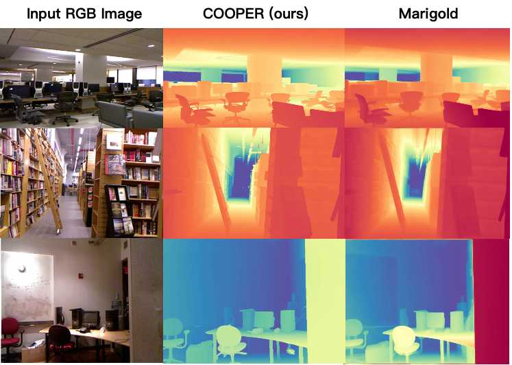
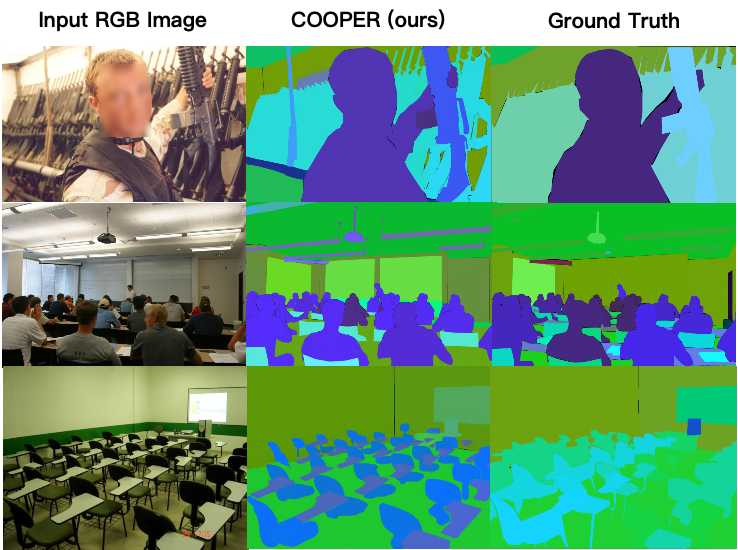

# COOPER 🧭

This project implements **COOPER**, a unified multimodal large language model for visual spatial intelligence that cooperatively couples perception and reasoning. Initially developed on top of the **BAGEL** framework to endow a single model with intrinsic perception enhancement (depth estimation, semantic segmentation) and reasoning enhancement via multimodal chain-of-thought, we further extend COOPER with reinforcement learning and a cooperative perception–reasoning reward to adaptively decide when to “perceive” and when to “reason” during inference.


## 🚀 Key Features

- 🧠 **GRPO Training for BAGEL via TRL**:
    - Fine-tune BAGEL-style multimodal models with RL-style objectives.
    - Optimize perception–reasoning behavior directly from feedback signals.
    - Seamlessly extend from supervised multimodal CoT training to RL-based refinement.

- 📊 **VLMEvalKit Integration for BAGEL**:
    - One-line evaluation on a wide range of multimodal benchmarks.
    - Unified interfaces for dataset loading, inference, and result aggregation.
    - Direct comparison with other VLMs under consistent evaluation protocols.

- 🧩 **[SIBench](https://sibench.github.io/Awesome-Visual-Spatial-Reasoning/) Single-Image Benchmark + GPT/Deepseek Answer Extraction**:
    - Fully integrated into **VLMEvalKit** as a first-class evaluation task.
    - Equipped with **GPT/Deepseek-based answer extractors** to:
    - Robustly parse free-form model outputs.
    - Reduce evaluation noise from formatting and phrasing.
    - Provide more accurate and reliable spatial reasoning scores.

---


## 🔥 Quick Start

1️⃣ **Set up environment 🛠️**

```bash
git clone https://github.com/zhangzef/COOPER.git
cd COOPER
conda create -n cooper python=3.10 -y
conda activate cooper
pip install -r requirements.txt
pip install flash_attn==2.5.8 --no-build-isolation
pip intall -e ./transformers-4.54.0
pip install -e ./trl
```


2️⃣ Download checkpoints and datasets 📥

```bash
cd models
# download the pretrained BAGEL and its config files
huggingface-cli download --resume-download --local-dir-use-symlinks False ByteDance-Seed/BAGEL-7B-MoT --local-dir BAGEL-7B-MoT

# not necessary
# download the COOPER-AMG ckpt(training with Auxiliary Modality Generation)
huggingface-cli download --resume-download --local-dir-use-symlinks False Starrrrrry/COOPER-AMG --local-dir COOPER-AMG

# not necessary
# download the COOPER ckpt if you want to inference with COOPER
huggingface-cli download --resume-download --local-dir-use-symlinks False Starrrrrry/COOPER --local-dir COOPER

# download the training data(without Hypersim)
cd ..
huggingface-cli download --resume-download --repo-type dataset Starrrrrry/COOPER_Train_Set --local-dir datasets
cd datasets
# merge the dataset with multiple threads(if you have pigz)(recommended)
cat COOPER_Train_Set.tar.gz.part.* | pigz -d | tar xf -
# OR merge the dataset with single thread(if you don't have pigz)
cat COOPER_Train_Set.tar.gz.part.* | gzip -dc | tar xf -
```


## 🔥 Train & Eval 🧪

### 🏋️ Train

```bash
# training for Auxiliary Modality Generation from BAGEL
# or you can download the COOPER-AMG directly
sh ./scripts/train_mix.sh

# training for interleaved reasoning SFT
sh ./scripts/train_reason_interleave_sft.sh

# training for interleaved reasoning GRPO
sh ./scripts/train_reason_interleave_grpo.sh
```


### 📐 Eval

```bash
# you can edit the eval config in /VLMEvalKit/eval_cfg/bagel_with_judge.json
# set your openai api key in eval_bagel_with_judge.sh and /VLMEvalKit/.env first
cd VLMEvalKit
sh eval_bagel_with_judge.sh
```


## 📈 Results


### 📚 Cases

You can find more cases in the `./assests` folder.








## ✍️ Citation
Our paper is cominng soon.